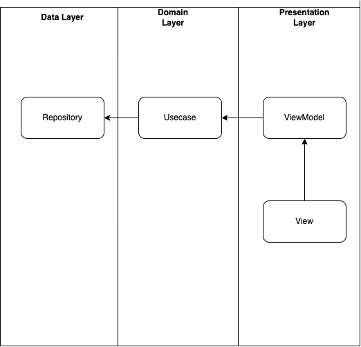
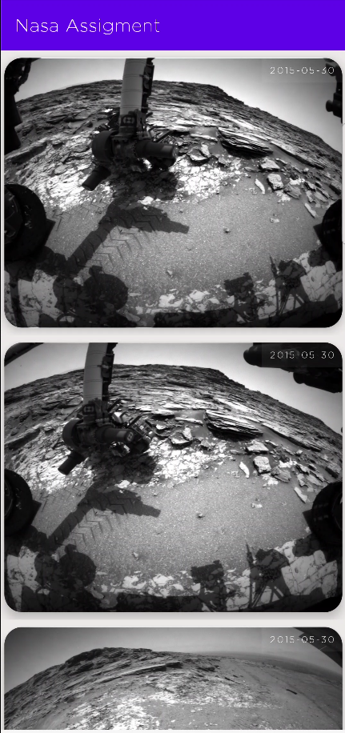
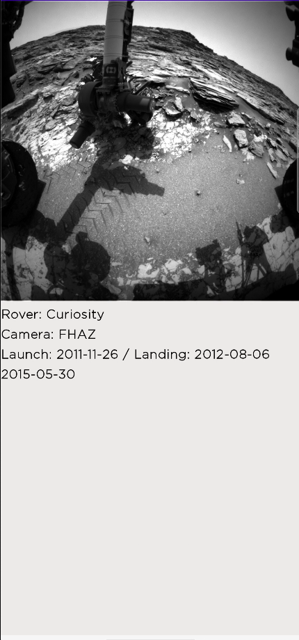

# Android Multi Module Nasa Project

Our purpose is how we can implement Multi Module project fit Clean Architecture.

## Our Architecture

## Built With 🛠
- [Kotlin](https://kotlinlang.org/) - First class and official programming language for Android development.
- [Coroutines](https://kotlinlang.org/docs/reference/coroutines-overview.html) - For asynchronous and more..
- [Flow](https://kotlin.github.io/kotlinx.coroutines/kotlinx-coroutines-core/kotlinx.coroutines.flow/-flow/) - A cold asynchronous data stream that sequentially emits values and completes normally or with an exception.
- [Android Architecture Components](https://developer.android.com/topic/libraries/architecture) - Collection of libraries that help you design robust, testable, and maintainable apps.
  - [ViewModel](https://developer.android.com/topic/libraries/architecture/viewmodel) - Stores UI-related data that isn't destroyed on UI changes. 
  - [ViewBinding](https://developer.android.com/topic/libraries/view-binding) - Generates a binding class for each XML layout file present in that module and allows you to more easily write code that interacts with views.
- [Dependency Injection](https://developer.android.com/training/dependency-injection) - 
  - [Hilt-Dagger](https://dagger.dev/hilt/) - Standard library to incorporate Dagger dependency injection into an Android application.
  - [Hilt-ViewModel](https://developer.android.com/training/dependency-injection/hilt-jetpack) - DI for injecting `ViewModel`.
- [Retrofit](https://square.github.io/retrofit/) - A type-safe HTTP client for Android and Java.
- [Moshi](https://github.com/square/moshi) - A modern JSON library for Kotlin and Java.
- [Moshi Converter](https://github.com/square/retrofit/tree/master/retrofit-converters/moshi) - A Converter which uses Moshi for serialization to and from JSON.

## Application Screenshoots

## Contributors
- Mustafa Kılıç  [@enciyo](https://github.com/enciyo)
- Hüseyin Serkan Özaydin [@hsmnzaydn](https://github.com/hsmnzaydn)